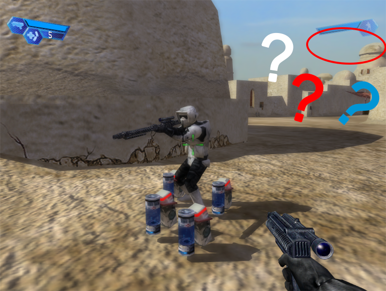
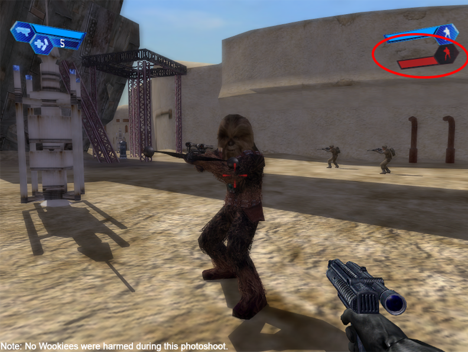
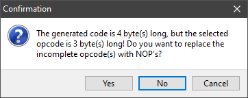
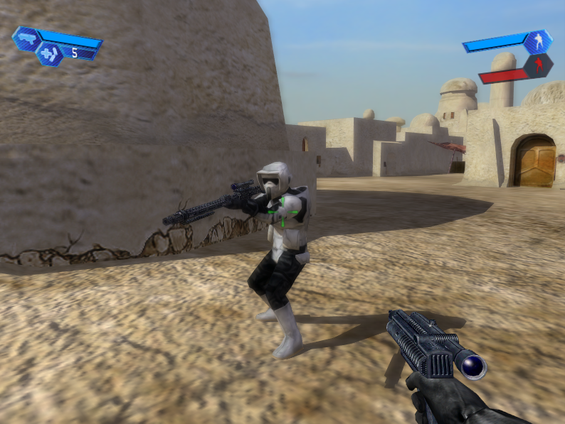
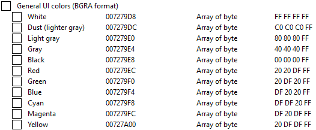

# Enhanced Health hud

Info: This does only work on SWBF 1.2 from 2004/5. The Steam version is not supported.

1. [Intro](#intro)
2. [Investigation](#investigation)
3. [Implementation](#implementation)
4. [Next steps? Yes!](#next-steps-yes)
5. [The colors](#the-colors)

---

## Intro

In SWBF II from 2005, players could see the health of their teammates and destructible objects, but in SWBF I, this feature was not available.  
This was problematic for pilots who rely on this information to determine whether their teammates need healing.

But I can see the health of this bear:  

## Investigation

The start was pretty straight forward: Scanning with Cheat Engine for a byte value that is 1 when the hud is visible and 0 when its hidden.  
After some time I had a memory address that matched. Now we need to find out, what code writes to this address.  
I found the code that checks if we're aiming at an enemy (-1), a friend (1) or at nothing/object (0):  
<pre><code>Battlefront.exe+1980C3 - 39 58 30 - cmp [eax+30],ebx</code></pre>

`eax + 30` is holding the address where the game is storing the target "relationship" status -1, 0, 1 (the memory address we found).
`ebx` has the value 0.

<pre><code>Battlefront.exe+1980C6 - 7D 18    - jnl Battlefront.exe+1980E0</pre></code>

The next instruction, a jump that is taken if we're **not** less than what we compared to, determines if the game shows the hud or not.  

When aiming at an enemy, the value is -1, which is less than 0, so we don't take the jump = show health.

## Implementation

There are multiple ways how we could rewrite these instructions. For example we could `nop` the jump or change the compare value to 2.  
What we _should_ do depends on how we want to implement this change.

If we were going to patch the binary, the `nop` should be used because we can just replace the 2 byte jump instruction `7D 18` with `90 90`.  
If we however want to change the compare value to the _number_ `2` we have a problem:

For the 32 bit (= 4 bytes) integer `2` we need, big surprise, 4 bytes. If we look at our `cmp` instruction, we see it only consits of 3 bytes. We cannot just add more bytes as we want because that would mess up the following opcodes:

<pre><code>Battlefront.exe+1980C3 - 83 78 30 02           - cmp dword ptr [eax+30],02        ; we replaced ebx with 2
Battlefront.exe+1980C7 - 18 8B 48203BCB        - sbb [ebx-34C4DFB8],cl            ; where did you come from?
Battlefront.exe+1980CD - 74 11                 - je Battlefront.exe+1980E0        ; and who are you?
</code></pre>

In our case, we could `nop` the second byte of the `jnl` instruction.
<pre><code>Battlefront.exe+1980C3 - 83 78 30 02 - cmp dword ptr [eax+30],02      ; we replaced ebx with 2
Battlefront.exe+1980C7 - 90          - nop                            ; this was the second byte of the jnl instruction
</code></pre>

As you can see we could just have `nop`ed the `jnl` in the first place.

On the other hand, if we do code injection it really does not matter how we do it.  
We allocate some memory in the context of the process where we can write our own code. We then use a `jmp` to unconditionally jump to our code, execute it and then jump back to the previous location where we continue with the normal game code.

Original code:
<pre><code>Battlefront.exe+1980C3 - 39 58 30       - cmp [eax+30],ebx
Battlefront.exe+1980C6 - 7D 18          - jnl Battlefront.exe+1980E0
Battlefront.exe+1980C8 - 8B 48 20       - mov ecx,[eax+20]
Battlefront.exe+1980CB - 3B CB          - cmp ecx,ebx
</code></pre>

We need 5 bytes for our `jmp` instruction. 3 from the `cmp` and 2 from the `jnl`.

After code injection:
<pre><code>Battlefront.exe+1980C3 - E9 387FBB01    - jmp 02150000       ; jump to our code
Battlefront.exe+1980C8 - 8B 48 20       - mov ecx,[eax+20]   ; when our code is done, we return here
Battlefront.exe+1980CB - 3B CB          - cmp ecx,ebx
</code></pre>

Of course we need to preserve the original code we replaced with our jump instruction.
This is what it looks like in our allocted memory:
<pre><code>02150000 - 83 78 30 02    - cmp [eax+30],02              ; "preserved" opcode with the first 3 bytes (we changed 'ebx' to '2')
02150004 - 0F8D D68044FE  - jnl Battlefront.exe+1980E0   ; preserved opcode with last 2 bytes (5 bytes total we needed for the jump)
0215000A - E9 B98044FE    - jmp Battlefront.exe+1980C8   ; jump back to the next instruction
</code></pre>

That's it. Now we can use this to see our teammates health!  

You can check out the enable script here: [scripts/enable.asm](scripts/enable.asm)

## Next steps? Yes!

Why stop there? Wouldn't it be nice to have different colors for enemies, teammates etc? Definitely!  
This was much more tricky but also a lot of fun!

## The colors

There was a lot of trial and error involved until I managed to find the red color address.  
Basically I digged around the health hud code and eventually found it.

Luckily, we developers like to group stuff that belongs together and that happend here as well.  
Next to the memory address of the red color I found several other colors as well!  
Another big bonus, those are all static addresses. Which means they don't change when we restart the game. :)  
(If they were dynamic instead we'd have to find pointers, later more on that)

## Switching the colors accordingly

As for most things, we have again multiple options here. E.g.:  

1. Change the opcode that loads the (red) color for the health hud
2. Change the value of the red color memmory address

I took the second option because I just could not get the first one to work properly.  
Colors were weird, random game crashes and the color switched immediately to gray when not aiming at something which is a problem because the hud fades out slowly.

So instead I injected the color management code where it gets only executed when there is target health data available. Then we update the red color memory address with for example a green color value when aiming at a mate.  
So basically the color stays at whatever current value it has until we aim at something that provides health data.

<pre><code>cmp [target],01
je target_is_mate
cmp [target],-1
je target_is_enemy
jmp target_is_neutral
</code></pre>

We then just set the desired color. For example:

<pre><code>target_is_mate:
mov [007279EC], FF20DF20    ; adjust "red" color to green (ARGB)
jmp back
</code></pre>

You can check out the color script here: [scripts/colors.asm](scripts/colors.asm)
