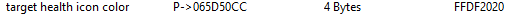
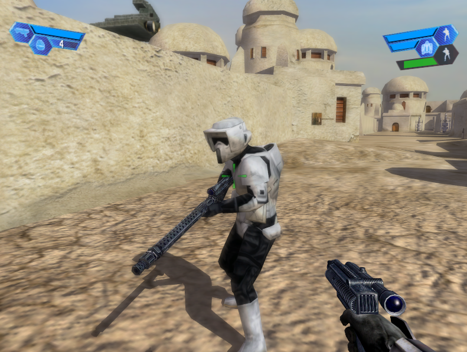
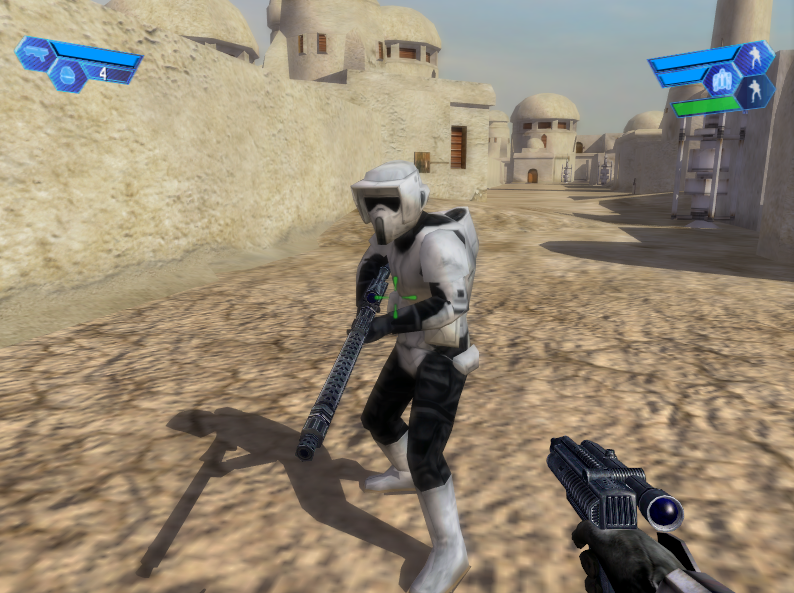

# Enhanced Health Hud

1. [Intro](#intro)
2. [Investigation](#investigation)
3. [Implementation](#implementation)
4. [Next steps? Yes!](#next-steps-yes)
5. [The colors](#the-colors)
6. [Switching the colors accordingly](#switching-the-colors-accordingly)
7. [What about the icon?](#what-about-the-icon)
   1. [Finding a pointer](#finding-a-pointer)
   2. [Implementing the icon color changer](#implementing-the-icon-color-changer)
8. [Extending on this and implementing a background color changer](#extending-on-this-and-implementing-a-background-color-changer)

---

## Intro

In SWBF II from 2005, players could see the health of their teammates and destructible objects, but in SWBF I, this feature was not available.  
This was problematic for pilots who rely on this information to determine whether their teammates need healing.


But I can see the health of this bear:  


## Investigation

The start was pretty straight forward: Scanning with Cheat Engine for a byte value that is 1 when the hud is visible and 0 when its hidden.  
After some time I had a memory address that matched. Now we need to find out, what code writes to this address.  
I found the code that checks if we're aiming at an enemy (-1), a friend (1) or at nothing/object (0):  

```asm
Battlefront.exe+1980C3 - 39 58 30 - cmp [eax+30],ebx
```

`eax + 30` is holding the address where the game is storing the target "relationship" status -1, 0, 1 (the memory address we found).
`ebx` has the value 0.

```asm
Battlefront.exe+1980C6 - 7D 18    - jnl Battlefront.exe+1980E0
```

The next instruction, a jump that is taken if we're **not** less than what we compared to, determines if the game shows the hud or not.  

When aiming at an enemy, the value is -1, which is less than 0, so we don't take the jump = show health.

## Implementation

There are multiple ways how we could rewrite these instructions. For example we could `nop` the jump or change the compare value to 2.  
What we _should_ do depends on how we want to implement this change.

If we were going to patch the binary, the `nop` should be used because we can just replace the 2 byte jump instruction `7D 18` with `90 90`.  
If we however want to change the compare value to the _number_ `2` we have a problem:


For the 32 bit (= 4 bytes) integer `2` we need, big surprise, 4 bytes. If we look at our `cmp` instruction, we see it only consits of 3 bytes. We cannot just add more bytes as we want because that would mess up the following opcodes:

```asm
Battlefront.exe+1980C3 - 83 78 30 02           - cmp dword ptr [eax+30],02        ; we replaced ebx with 2
Battlefront.exe+1980C7 - 18 8B 48203BCB        - sbb [ebx-34C4DFB8],cl            ; where did you come from?
Battlefront.exe+1980CD - 74 11                 - je Battlefront.exe+1980E0        ; and who are you?
```

In our case, we could `nop` the second byte of the `jnl` instruction.

```asm
Battlefront.exe+1980C3 - 83 78 30 02     - cmp dword ptr [eax+30],02      ; we replaced ebx with 2
Battlefront.exe+1980C7 - 90              - nop                            ; this was the second byte of the jnl instruction
```

As you can see we could just have `nop`ed the `jnl` in the first place.

On the other hand, if we do code injection it really does not matter how we do it.  
We allocate some memory in the context of the process where we can write our own code. We then use a `jmp` to unconditionally jump to our code, execute it and then jump back to the previous location where we continue with the normal game code.

Original code:

```asm
Battlefront.exe+1980C3 - 39 58 30       - cmp [eax+30],ebx
Battlefront.exe+1980C6 - 7D 18          - jnl Battlefront.exe+1980E0
Battlefront.exe+1980C8 - 8B 48 20       - mov ecx,[eax+20]
Battlefront.exe+1980CB - 3B CB          - cmp ecx,ebx
```

We need 5 bytes for our `jmp` instruction. 3 from the `cmp` and 2 from the `jnl`.

After code injection:

```asm
Battlefront.exe+1980C3 - E9 387FBB01    - jmp 02150000       ; jump to our code
Battlefront.exe+1980C8 - 8B 48 20       - mov ecx,[eax+20]   ; when our code is done, we return here
Battlefront.exe+1980CB - 3B CB          - cmp ecx,ebx
```

Of course we need to preserve the original code we replaced with our jump instruction.
This is what it looks like in our allocted memory:

```asm
02150000 - 83 78 30 02    - cmp [eax+30],02              ; "preserved" opcode with the first 3 bytes (we changed 'ebx' to '2')
02150004 - 0F8D D68044FE  - jnl Battlefront.exe+1980E0   ; preserved opcode with last 2 bytes (5 bytes total we needed for the jump)
0215000A - E9 B98044FE    - jmp Battlefront.exe+1980C8   ; jump back to the next instruction
```

That's it. Now we can use this to see our teammates health!  


You can check out the enable script here: [scripts/enable.asm](scripts/enable.asm)

## Next steps? Yes!

Why stop there? Wouldn't it be nice to have different colors for enemies, teammates etc? Definitely!  
This was much more tricky but also a lot of fun!

## The colors

There was a lot of trial and error involved until I managed to find the red color address.  
Basically I digged around the health hud code and eventually found it.

Luckily, we developers like to group stuff that belongs together and that happend here as well.  
Next to the memory address of the red color I found several other colors as well!  
Another big bonus, those are all static addresses. Which means they don't change when we restart the game. :)  
(If they were dynamic instead we'd have to find pointers, later more on that)


## Switching the colors accordingly

As for most things, we have again multiple options here. E.g.:  

1. Change the opcode that loads the (red) color for the health hud
2. Change the value of the red color memmory address

I took the second option because I just could not get the first one to work properly.  
Colors were weird, random game crashes and the color switched immediately to gray when not aiming at something which is a problem because the hud fades out slowly.

So instead I injected the color management code where it gets executed only when there is target health data available. Then we update the red color memory address with for example a green color value when aiming at a mate.  
So basically the color stays at whatever current value it has until we aim at something that provides health data.

```asm
cmp [target],01
je target_is_mate
cmp [target],-1
je target_is_enemy
jmp target_is_neutral
```

We then just set the desired color. For example:

```asm
target_is_mate:
mov [007279EC], FF20DF20    ; adjust "red" color to green (ARGB)
jmp back
```

And there we go:  


And for neutral objects we have a blue color:


## What about the icon?

With Cheat Engine it was pretty easy to find out what else accesses the red color.  
I found the instruction responsible for coloring the icon but it only executes once on map load.
It loads the color value into a different memory location that we can then manipulate.

This time it was not a static address. Instead I had to find a pointer.

> A pointer is a type of variable that stores the address of another variable in memory. It allows a program to indirectly access and manipulate the value stored at that memory location. Sometimes, a pointer stores the base address of an object, and offsets can be used to access specific properties within the object by adding the offset to the base address.

### Finding a pointer

There are many ways to find pointers but a basic approach is illustrated below:

This is the instruction that copies the color value stored in `eax` to the offset `107C` of the address that `esi` is holding.

```asm
Battlefront.exe+197BEE - 89 86 7C100000  -  mov [esi+0000107C],eax
```

Here's what the relevant register values look like:  
`eax` = FFDF2020 -> This is the red color hex value (alpha, red, green, blue)  
`esi` = 065D4050 -> This is the base address to the hud element probably

When we add the offset `107C` to the value of `esi` we get `65D50CC` which is in fact the current address where the color of the icon is stored as you can see in this screenshot from Cheat Engine:  


Moving on, the part we should remeber is the offset value `107C`.  
Cheat Engine has a feature called _Pointerscan_. Right click on the address and select "Pointer scan for this address".


Note that we already know the last offset the pointer needs to have! `107C`.  
We can add it at "pointers must end with specific offset".

After pressing OK, Cheat Engine will scan for us. This may take a moment.  
We are then hopefully presented with a list of several potential pointers.  
To verify if they are legit, we save them to our addresslist and restart the game.  
If they still point to the correct address (which is probably no longer `65D50CC`) and show the correct value, we have found one or more pointers!

### Implementing the icon color changer

For this we extend the color manager script. Here's the important part:

How we can use the pointer for the icon color in asm:

```asm
; Load the value (base address) stored at the memory address "Battlefront.exe"+0035D3E0 into eax
mov eax,["Battlefront.exe"+0035D3E0]

; Load the value stored at the memory address stored in eax + C into eax
mov eax,[eax+C]

; Load the value stored at the memory address stored in eax + 4C into eax
mov eax,[eax+4C]

; Load the value stored at the memory address stored in eax + C into eax
mov eax,[eax+C]

; Add the value 107C to the address stored in eax and store the result in eax
add eax,107C
```

> The final `add` instruction is used to calculate the final memory address by adding an offset to the address stored in the eax register. By using `add` instead of `mov`, the **value of the address** stored in `eax` is preserved, rather than being overwritten with the **value stored at that address**.

I put this code into a custom label so that I don't have to repeat the code for each color (enemy, mate, neutral).

A barebone example would look like this:

Aiming at a teammate.

```asm
target_is_mate:
mov [007279EC], FF20DF20    ; adjust "red" color to green (ARGB)
push FFEEEEEE               ; push blue-ish color value for the icon onto the stack
jmp update_hud_color        ; jump to our label that updates the icon color
```

```asm
update_hud_color:
push eax            ; preserve the current values by pushing them on the stack
push ecx            ; we want to restore them when we're done
xor eax,eax         ; set them to 0 just to be safe
xor ecx,ecx

; pointer to icon color
mov eax,["Battlefront.exe"+0035D3E0]
mov eax,[eax+C]
mov eax,[eax+4C]
mov eax,[eax+C]
add eax,107C

; get color value from stack (we pushed it onto the stack before jumping here)
; BUT NOTE - we have pushed two more values onto the stack! eax and ecx. Each 4 bytes.
mov ecx,[esp+8]   ; our color value is now at offset 8 on the stack
mov [eax],ecx     ; put color value into icon color addr

; cleanup
pop ecx           ; put the preserved value back into ecx, clearing the first 4 bytes of the stack
pop eax           ; put the preserved value back into eax, again clearing the now first bytes of the stack
add esp,4         ; Our color value is now at offset 0 on the stack. Remove it from the stack
jmp originalcode
```

The stack may seem complex, but it's important to remember that it operates using a Last In, First Out (LIFO) principle. This means that the last item placed on the stack is the first one that needs to be removed.

Blue for objects, white for teammates and red for enemies  



## Extending on this and implementing a background color changer

To make it look more appealing I followed the same procedure as before and implemented a color changer for the background color of the health hud.




You can check out the color script here: [scripts/colors.asm](scripts/colors.asm)

## Video demo

https://user-images.githubusercontent.com/24588573/211107861-2f5668f6-14db-41e6-bca0-7b708f75fa2f.mp4

## Conclusion

This project was a lot of fun and I learned quite a lot during the process.  
It took me several hours to put this all together but I am very happy with the outcome. It is even multiplayer compatible.

One of the most challenging aspects for me was understanding how to use pointers in Assembly language, particularly when it came to adding the final offset. I hope that my explanation of this process is clear enough for anyone reading this to understand.

Any feedback is very welcome. Especially if you find factual mistakes.  
I am by no means a professional on this topic but I tried my best to describe it as accurate as possible.

Discord: mriot#2627
