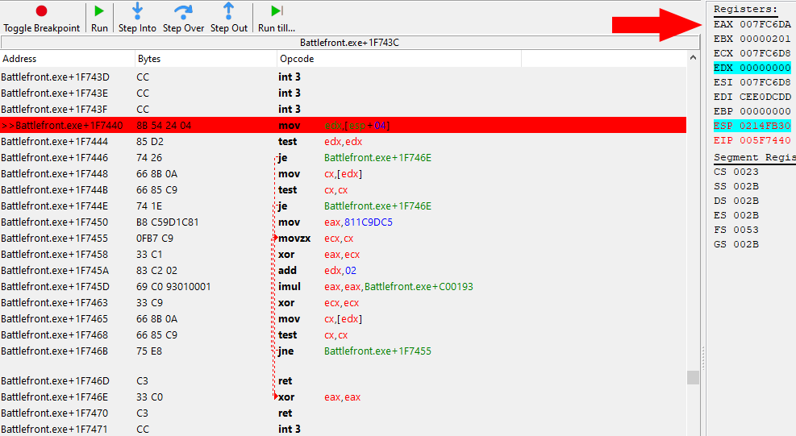

# Jub Jub

Star Wars Battlefront (2004 / Classic) easter egg research.


## Table of contens

1. [Table of contens](#table-of-contens)
2. [Motivation](#motivation)
3. [Facts about the easter egg](#facts-about-the-easter-egg)
4. [Starting the research](#starting-the-research)
   1. [About savegame files in Battlefront](#about-savegame-files-in-battlefront)
   2. [Finding patterns within the profiles](#finding-patterns-within-the-profiles)
   3. [Conclusion on the profile theory](#conclusion-on-the-profile-theory)
5. [Another approach](#another-approach)
6. [The check](#the-check)
7. [The hashing function](#the-hashing-function)
   1. [Implementation](#implementation)
8. [Experiments](#experiments)
9. [Scripts and Cheat Table](#scripts-and-cheat-table)
10. [Conclusion](#conclusion)
11. [Resources](#resources)
12. [Thanks](#thanks)
13. [Disclaimer](#disclaimer)

---

## Motivation

Battlefront was my first game that I ever played in multiplayer back in ca. 2010.  
Over the years the game indirectly introduced me to several computer related topics such as webdesign, creating maps and modding game files, memory editing and reading and writing assembly just to name a few.  
When I was first told about this easter egg I was fascinated. I have never heard of such things before.

Immediately questions came to my mind like: Is this intentionally? A bug maybe? How does it work and why?

## Facts about the easter egg

> "Jub Jub" ewoks saying bla bla bla

- The name of the profile has to be exactly: `Jub Jub`
- It only works in singleplayer. Even as the server host, the soldier models are normal
- It still works even with the Steam-Version of the game

## Starting the research

Looking at the facts above, we can safely assume, that this is indeed not a bug.

My first guess was that it might has something to do with the profile or savegame file iteself, since the easter egg is related to the name.  

### About savegame files in Battlefront

The file extension is `.profile`.  
They reside inside the install directory in a folder called `SaveGames`  

The game seems to be storing several things in these files:

- The nickname of course
- Settings such as resolution, difficulty, etc
- campaign progress
- and more

Interestingly, the game does not use the actual name within the profile data but rather the filename to display the nickname.  
I assume they did this, that in case of a corrupted profile, they still can display the name in the selection screen.


Renaming or changing the contents with a hexeditor corrupts a profile so there's probably an integrity check in place.


### Finding patterns within the profiles

In the following screenshot we're comparing two profile savegame files that are identical except for their name.  
They have the exact same settings, equal progress in compaigns and so forth.

The byte differences are listed side by side where the left column represents the "Jub Jub" profile and the right column represtens the "Abc Def" profile.  
Note that both names have a space at the same position and thus no difference at this particular byte.


In this comparisation I have only changed the difficulty of one savegame for otherwise completely identical profiles:


### Conclusion on the profile theory

At this point I was pretty confident, that the easter egg is not activated or controlled by the savegame file iteself.  
It could have been possible that the game sets a certain byte within the file upon profile creation but after comparing and experimenting with these files we can safely assume that this is not the case.

## Another approach

Moving on I decided to scan the memory of the game and search for a flag, a byte that indicates whether the easter egg is enabled.

As it turned out, that was pretty easy to find. I checked which opcodes access this address.

## The check

I found this code:  


First `eax` is pushed onto the stack followed by a `call` instruction. This usually indicates, that the value of `eax` is used within that function.  

Lets have a quick look into that function and set a breakpoint to find out what the value of `eax` is.


This looks like a memory address!
Lets check out what the value of that address is:


Awesome, we found the profile name address!  
We will dive deeper into that function in the next step but for now we can assume that that this function generates the hash for our profile name and that the result is stored in the `EAX` register.

Returning to the previous code, after the `call` instruction, we can see a hardcoded compare, that compares our hash in `EAX` with a hexadecimal number `C6961FF7`. Interesting.  
To find out if this magic number is the hash for "Jub Jub", I placed a breakpoint on that compare and picked the "Jub Jub" profile.


Nice! They match! Awesome :)  
For testing purposes my main profiles hash: `EAX: 3520CC84`

Following the rest of the instructions we can see that apparently, the easter egg will be enabled for every profile for a brief moment before it is disabled on non "Jub Jub" profiles.  
The byte is unconditionally set to 1 directly after the compare and the next jump is only taken, when the hashes match essentially skipping deactivating the easter egg.

## The hashing function

I stepped through the function and noticed that `EDX` is assigned the same value that `EAX` is holding.  
Only if `EDX` is 0, which will probably only happen if the profile does not have a name, `EAX` gets zeroed with `xor eax,eax`. I guess that is part of some error handling.


Image source: <https://www.cs.virginia.edu/~evans/cs216/guides/x86.html#instructions>

- Hash algorithm: [Fowler–Noll–Vo](https://en.wikipedia.org/wiki/Fowler%E2%80%93Noll%E2%80%93Vo_hash_function#The_hash)
...

### Implementation

#### In C\#

[fnv-algo.cs](fnv-algo.cs)
...

#### In JavaScript

...

## Game code that makes the easter egg have an effect


## Experiments

videos/removing-spine-bone.mp4
...

## Scripts and Cheat Table

Instant model swapper?

Disable profile integrity check (the game will also fix the profile with any valid modification)
...

## Conclusion

- Surprised that the revered algo actually worked
- challenging: reversing of the algo - stack overflow question (glad there is such a forum)
- Happy to have lifted this mystery
- learned a lot and was fun

## Resources

- [Cheat Engine](https://www.cheatengine.org/)
- Hex Editor
- x86 Assembly: <https://www.cs.yale.edu/flint/cs421/papers/x86-asm/asm.html>
- <https://stackoverflow.com/questions/62778926/third-operand-of-imul-instruction-is-a-memory-address-what-was-its-original-val>

## Thanks

- Pandemic and LucasArts for SWBF
- DarkByte for Cheat Engine
- [Psych0fred](http://secretsociety.com/forum/display_forum.asp) for providing a lot to the modding community
- [SWBFGamers.com](http://www.swbfgamers.com/)
- CherryDT for answering my StackOverflow question ([see resources](#Resources))
- Markdeagle for unintentionally waking my interest in computer science (and metal 🤘)
- To my buddy Jay

## Disclaimer

...

---

```none
Viathan Profile: EAX = 3520CC84
Jub Jub Profile: EAX  = C6961FF7
Battlefront.exe+1F71C5 - 3D F71F96C6 - cmp eax,C6961FF7
```

char boon root is adjusted as they would just stick in the ground otherwise
tat_inf_jawa along with bone information is present as static address.
other statics are only humanoid like vader, luke etc
changing tat_inf_jawa to all_inf_lukeskywalker seems to be working
maybe we can swap the model using mods
it seems the geometry is hardcoded and not actually using the model found in the side.lvl files

spine length?
Battlefront.exe+132766 - 68 E47A6A00           - push Battlefront.exe+2A7AE4 { ("bone_a_spine") }
Battlefront.exe+13276B - C7 07 FFFFFFFF        - mov [edi],FFFFFFFF { -1 }
Battlefront.exe+132771 - C7 47 04 FFFFFFFF     - mov [edi+04],FFFFFFFF { -1 }
Battlefront.exe+132778 - E8 03EAECFF           - call Battlefront.exe+1180
