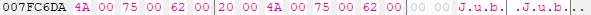

# Jub Jub

Star Wars Battlefront (2004 / Classic) easter egg research.


## Table of contens

1. [Table of contens](#table-of-contens)
2. [Motivation](#motivation)
3. [Facts about the easter egg](#facts-about-the-easter-egg)
4. [Starting the research](#starting-the-research)
   1. [About savegame files in Battlefront](#about-savegame-files-in-battlefront)
   2. [Finding patterns within the profiles](#finding-patterns-within-the-profiles)
   3. [Conclusion on the profile theory](#conclusion-on-the-profile-theory)
5. [Another approach](#another-approach)
6. [The check](#the-check)
7. [The hashing function](#the-hashing-function)
   1. [A short lesson about the stack](#a-short-lesson-about-the-stack)
   2. [A short lesson on x86 registers](#a-short-lesson-on-x86-registers)
   3. [Other interesting things in this algorithm](#other-interesting-things-in-this-algorithm)
   4. [Implementation](#implementation)
8. [Game code that makes the easter egg have an effect](#game-code-that-makes-the-easter-egg-have-an-effect)
9. [Experiments](#experiments)
10. [Scripts and Cheat Table](#scripts-and-cheat-table)
11. [Conclusion](#conclusion)
12. [Resources](#resources)
13. [Thanks](#thanks)

---

## Motivation

Battlefront was my first game that I ever played in multiplayer back in ca. 2010.  
Over the years the game indirectly introduced me to several computer related topics such as webdesign, creating maps and modding game files, memory editing and reading and writing assembly just to name a few.  
When I was first told about this easter egg I was fascinated. I have never heard of such things before.

Immediately questions came to my mind like: Is this intentionally? A bug maybe? How does it work and why?

## Facts about the easter egg

> "Jub Jub" ewoks saying bla bla bla

- The name of the profile has to be exactly: `Jub Jub`
- It only works in singleplayer. Even as the server host, the soldier models are normal
- It still works even with the Steam-Version of the game

## Starting the research

Looking at the facts above, we can safely assume, that this is indeed not a bug.

My first guess was that it might has something to do with the profile or savegame file iteself, since the easter egg is related to the name.  

### About savegame files in Battlefront

The file extension is `.profile`.  
They reside inside the install directory in a folder called `SaveGames`  

The game seems to be storing several things in these files:

- The nickname of course
- Settings such as resolution, difficulty, etc
- campaign progress
- and more

Interestingly, the game does not use the actual name within the profile data but rather the filename to display the nickname.  
I assume they did this, that in case of a corrupted profile, they still can display the name in the selection screen.


Renaming or changing the contents with a hexeditor corrupts a profile so there's probably an integrity check in place.


### Finding patterns within the profiles

In the following screenshot we're comparing two profile savegame files that are identical except for their name.  
They have the exact same settings, equal progress in compaigns and so forth.

The byte differences are listed side by side where the left column represents the "Jub Jub" profile and the right column represtens the "Abc Def" profile.  
Note that both names have a space at the same position and thus no difference at this particular byte.


In this comparisation I have only changed the difficulty of one savegame for otherwise completely identical profiles:


### Conclusion on the profile theory

At this point I was pretty confident, that the easter egg is not activated or controlled by the savegame file iteself.  
It could have been possible that the game sets a certain byte within the file upon profile creation but after comparing and experimenting with these files we can safely assume that this is not the case.

## Another approach

Moving on I decided to scan the memory of the game and search for a flag, a byte that indicates whether the easter egg is enabled.

As it turned out, that was pretty easy to find. I checked which opcodes access this address.

## The check

I found this code:  


First `EAX` is pushed onto the stack followed by a `call` instruction. This indicates, that the value of `EAX` is used within that function (i.e. passed as an argument).  

Lets set a breakpoint to find out what the value of `EAX` is before it's passed to the function.


Hmm, this looks like a memory address!

Lets check out what the value at that address is:


Great! We found the profile name address!  
So `EAX` is holding the adress to our name and that is passed to the function.  
A quick look into that function reveals that it does some processing with the name.

> We will dive deeper into that function in the next step but for now we assume that that this function generates a hash for our profile name and that the result is stored in the `EAX` register.

After the `call` instruction, we can see a compare, that compares our hash in `EAX` with a hexadecimal number `C6961FF7`. Interesting.  Maybe it's the hash for "Jub Jub"?!  
To find out, I placed a breakpoint on that compare and picked the "Jub Jub" profile.


**Nice**! As we can see, the value in `EAX` is the same as our magic number. :)  
For testing purposes I picked my main profile and this was the generated hash: `EAX: 3520CC84`.

Following the rest of the instructions we can see that apparently, the easter egg will be enabled for every profile for a brief moment before it is disabled on non "Jub Jub" profiles.  
The byte is unconditionally set to 1 directly after the compare and the next jump is only taken, when the hashes match. Essentially skipping the deactivation of the easter egg.

Now it's time to take a closer look at...

## The hashing function


At first glance it might look a little complicated so I added some comments to describe what I think is going on.


### A short lesson about the stack

First of all you might be asking why `ESP+4` is holding our `EAX` argument with the name address.  
`ESP` is the so called _stack pointer_. The _stack_ itself is basically a _Last In, First Out (LIFO)_ storage used (among other things) for passing arguments to functions.  
`ESP` holds the base pointer address of the stack.

Remember, before calling this function the game did `push EAX` placing the value of `EAX` on the stack.  
It was placed at the top or first position on the stack which is `ESP+0` or just `ESP`.  
The `+ NUMBER` part is the offset in bytes.

So why is our name address now, when we are inside the hashing function, at `ESP+4`?  
Because of the `call` instruction.  
`call` jumps to a function and that needs to return somewhere when it is done. The address to where it should return is stored on the stack as well. At the first position `ESP+0`, essentially pushing everything else on the stack further down.  
And since the return address is 4 bytes long, we need to retrieve our argument with `ESP+4`.

### A short lesson on x86 registers

After the first `je` you'll see the instruction: `mov cx,[edx]` with the comment describing that the first character of the name is put into `CX`.

As a 32 bit game it has access to several 32 bit (4 byte) registers, which are small super fast storage units on the CPU.  
These can be split into even smaller portions like this graphic illustrates:


Image source: <https://www.cs.virginia.edu/~evans/cs216/guides/x86.html#registers>

So, what is our instruction doing?  
As we know, `EDX` is holding the address to our name. And by writing `[EDX]` (note the brackets) we access the **value** of the **memory address** `EDX` is holding.

`mov cx,[edx]` instructs the computer to take the **value** of the **address** and place it in `CX` which can only hold 2 bytes.  

After this instruction the `ECX` register looks like this:


We ignore the first two bytes (`00 7F`) in the register since they were in there before.  

The bytes we care about are `00 4A` where `4A` is [ASCII](https://en.wikipedia.org/wiki/ASCII) for the letter "J". The first character of our name.  
The profile name is encoded in [Unicode](https://en.wikipedia.org/wiki/Unicode) more specifically in UTF-16. That makes `00` part of our ASCII charater "J" because we have two bytes for each character available.  
A unicode character that uses both bytes for example is the Euro € symbol: `20 AC`

<pre>
'J'  ->  U+00 4A
'u'  ->  U+00 75
'b'  ->  U+00 62
' '  ->  U+00 20
'J'  ->  U+00 4A
'u'  ->  U+00 75
'b'  ->  U+00 62
</pre>

In memory that looks like: 

### Other interesting things in this algorithm

After the second `je` instruction we see `mov eax,811C9DC5`. This hardcoded value in the context of a hashing algorithm is known as the "offset basis", and is used as the starting point for the hash calculation.

Further down we can find `69 C0 93010001 - imul eax,eax,Battlefront.exe+C00193` and this gave me a hard time.  
I was not able to understand the third operants but luckily there are helpful people on the internet as you can read in my [question on StackOverflow](https://stackoverflow.com/questions/62778926/third-operand-of-imul-instruction-is-a-memory-address-what-was-its-original-val). Thanks again CherryDT!

<details>
   <summary>👀 Screenshot of that question and answer</summary>

   
</details>

<pre>
811C9DC5 -> Offset basis
01000193 -> Prime number
</pre>

So after reversing the hashing alogrithm for hours and getting a headache about that `imul` we now know which alogrithm they used!

The [FNV-1a (Fowler-Noll-Vo hash function 1a)](https://en.wikipedia.org/wiki/Fowler%E2%80%93Noll%E2%80%93Vo_hash_function#The_hash) is a non-cryptographic hash function that was developed in 1991.

A screenshot from Wikipedia shows both hardcoded values:


### Implementation

#### In C\#

Here is the initial version of the reversed alogorithm: [fnv-algo.cs](fnv-algo.cs)

<details>
   <summary>👀 Show code</summary>

```cs
using System;

namespace BattlefrontNameHash {
    class Program {
        static void Main(string[] args) {
            start();
        }

        static void start() {
            Console.Write("Enter a name to generate the hash for: ");
            string input = Console.ReadLine();

            Console.WriteLine("=> Hash for {0} is {1}\n", input, generateHash(input).ToString("X"));
            start();
        }

        static uint generateHash(string input) {
            // Battlefront.exe+1F744B - test cx,cx
            if (input.Length <= 0) return 0;

            // Battlefront.exe+1F7450 - mov eax,811C9DC5
            uint hash = 0x811C9DC5; // base hash

            for (int i = 0; i < input.Length; i++) {
                // Battlefront.exe+1F7458 - xor eax,ecx
                hash ^= input[i];

                /*
                 * Here the third operand (source2) of imul got misinterpreted by the disassembler
                 * it is actually a prime number and not a memory address.
                 * If you add the base address (0x00400000) and 0xC00193, the result is 0x1000193
                 */
                // Battlefront.exe+1F745D - imul eax,eax,Battlefront.exe+C00193
                hash *= 0x1000193;
            }

            return hash;
        }
    }
}
```

</details>

#### In JavaScript

Just for fun I made a little Svelte app that lets you test the algorithm online.  
<link/to/website>

## Game code that makes the easter egg have an effect


## Experiments

videos/removing-spine-bone.mp4

char boon root is adjusted as they would just stick in the ground otherwise
tat_inf_jawa along with bone information is present as static address.
other statics are only humanoid like vader, luke etc
changing tat_inf_jawa to all_inf_lukeskywalker seems to be working
maybe we can swap the model using mods
it seems the geometry is hardcoded and not actually using the model found in the side.lvl files

## Scripts and Cheat Table

- Instant model swapper?
- Disable profile integrity check (the game will also fix the profile with any valid modification)
- Enable easter egg for any profile
  - flag address

## Conclusion

In conclusion, it was honestly surprising to me that the reversed FNV-1a algorithm actually worked as expected 😁. The process was challenging as it was my first time trying something like this.

Overall, this project was not only enjoyable but I learned a lot, too.  
I'm also super happy I was able to successfully lift the mystery surrounding that easter egg!

Feedback is always welcome, and I appreciate any corrections or suggestions for improvement. Although I'm not a professional on this topic, I've done my best to present the information accurately and clearly. Thank you for reading!

Discord: mriot#2627

## Resources

- [Cheat Engine](https://www.cheatengine.org/)
- [HxD Hex Editor](https://mh-nexus.de/en/hxd/)
- x86 Assembly: <https://www.cs.yale.edu/flint/cs421/papers/x86-asm/asm.html>
- <https://stackoverflow.com/questions/62778926/third-operand-of-imul-instruction-is-a-memory-address-what-was-its-original-val>

## Thanks

- Pandemic for SWBF
- DarkByte for Cheat Engine
- CherryDT for answering my StackOverflow question
- Psych0fred for your invaluable contributions to the modding community
- Markdeagle
- Jay

---

spine length?
Battlefront.exe+132766 - 68 E47A6A00           - push Battlefront.exe+2A7AE4 { ("bone_a_spine") }
Battlefront.exe+13276B - C7 07 FFFFFFFF        - mov [edi],FFFFFFFF { -1 }
Battlefront.exe+132771 - C7 47 04 FFFFFFFF     - mov [edi+04],FFFFFFFF { -1 }
Battlefront.exe+132778 - E8 03EAECFF           - call Battlefront.exe+1180
